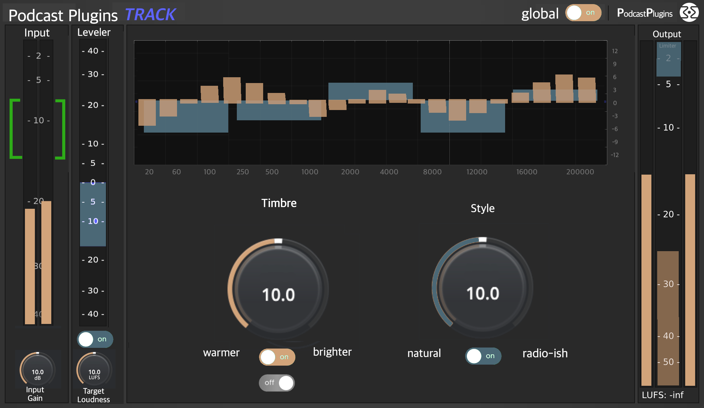

# Podcast Plugins
Podcast Plugins are under development. The first release is scheduled for 1st of March 2025.

Podcast Plugins are easy to use plugins for speech enhancement, specifically designed for podcasters who can't or don't want to dig deeper into the craft of sound engineering.
The bundle consists of two plugins:

## Podcast Plugin TRACK
This plugin is inserted on the individual audio tracks of all speakers. It wil take care of level, equalisation and dynamic processing.

 *mockup of Podcast Plugin Track*

## Podcast Plugin MASTER
This plugin is inserted on the audio master bus of the DAW. It will shape the sound some more and take care of lebels and dynamics.

 *mockup of Podcast Plugin Master*

# Development
The DSP is written in [Faust](https://faust.grame.fr) by [Klaus Scheuermann](https://4ohm.de)

The plugins are made by [ƒalkTX](https://github.com/falkTX) using [DPF](https://github.com/DISTRHO/DPF).