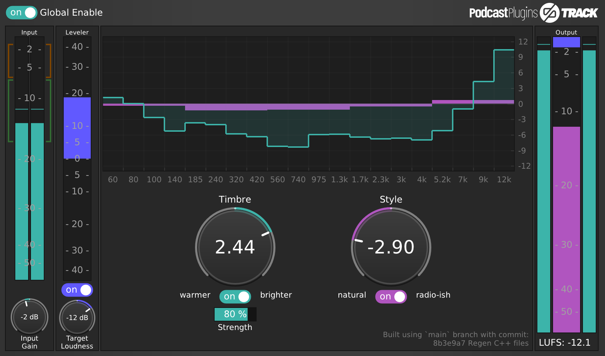
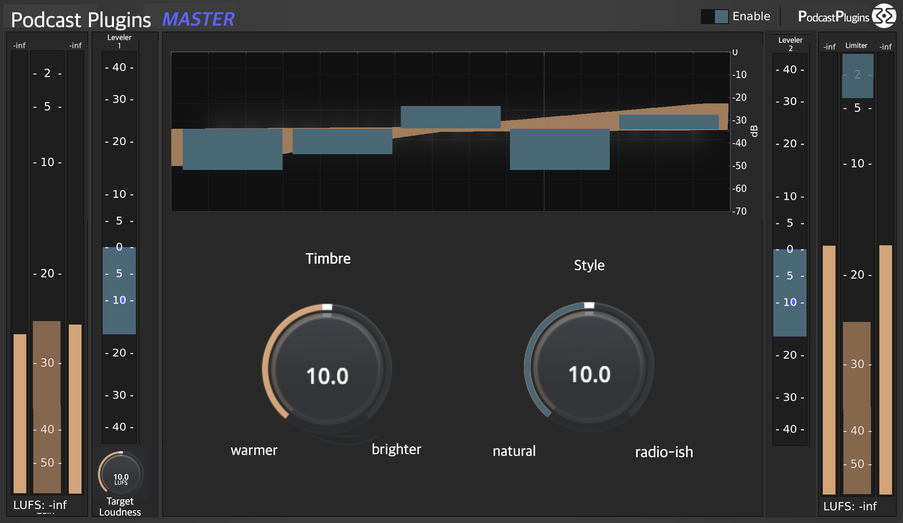

# PodcastPlugins
Podcast Plugins are **under development**. The first release is scheduled for 1st of March 2025.

Podcast Plugins are easy-to-use plugins for speech enhancement, specifically designed for podcasters who can't or don't want to dig deeper into the craft of sound engineering.

The bundle consists of two plugins:

## PodcastPlugins **TRACK**
This plugin is inserted on the individual audio tracks of all speakers. It wil take care of level, equalisation and dynamic processing.

 *screenshot of Podcast Plugin Track*

## PodcastPlugins **MASTER**
This plugin is inserted on the audio master bus of the DAW. It will shape the sound some more and take care of levels and dynamics.

 *mockup of Podcast Plugin Master*

# Development
The DSP is written in [Faust](https://faust.grame.fr) by [Klaus Scheuermann](https://4ohm.de).

The plugins are made by [ƒalkTX](https://github.com/falkTX) using [DPF](https://github.com/DISTRHO/DPF).

The logo and signet are by [Peter Schlossnikel](https://petriografie.de).

Programming guidance and lovely bits of foss code have been provided by [Robin](https://github.com/x42), [magnetophone](https://github.com/magnetophon), [Jakob](https://gist.github.com/jkbd), [Dario](https://github.com/dariosanfilippo). Thanks <3

PodcastPlugins are supported by the PrototypeFund.

# Installation
Podcast Plugins are cross-platform and will work on the following operating systems:

- [macOS](#install_macos)
- [windows](#install_windows)
- [linux](#install_linux)
- [other](#install_other)

Supported plugin formats are CLAP, VST, VST3, LV2 and AU. 

Download the installers for your operating system [here](https://github.com/trummerschlunk/PodcastPlugins/actions). (link tba)

The installer will put the plugin files in the appropriate folders on your system. The next time you start your DAW, they will be available.

## macOS

The installer will work for intel macs and silicon/arm macs.

As the installer is not signed, you will have to allow the installer to run. Please learn more for your macOS version [here](https://support.apple.com/guide/mac-help/open-a-mac-app-from-an-unknown-developer-mh40616/15.0/mac/15.0).

## windows
tba

## linux
tba

## other OS
tba

# Getting Startet
After installation, two plugins are available in your DAW:

## PocastPlugins **TRACK**
**TRACK** is the actual speech-enhancement plugin. It goes on each individual track of each speaker.

> For example:
>
> You recorded two speakers with two microphones to two individual tracks:
> Please load an instance of **TRACK** on to each track.

*screenshot of DAW with TRACK Plugin*

The default setting of the **TRACK** plugin will be fine in most cases. You can close the plugin window and just let it do it's thing.

If you want to tweak the sound further, read [advanced settings](#advanced_settings_track).

## PodcastPlugin **MASTER**
**MASTER** is an automatic leveling and mastering plugin which will take care of the final touch of your podcast. It goes on the master channel of your DAW project.

*screenshot of DAW with MASTER Plugin*

The default setting of the **MASTER** plugin will be fine in most cases. You can close the plugin window and just let it do it's thing.

If you want to tweak the sound further, read [advanced settings](#advanced_settings_master).

# Advanced Settings

## Advanced Settings for PodcastPlugins **TRACK**

With the two big knobs in the middle, you can tweak the sound of your speaker:

### **TIMBRE**

**TIMBRE** controls if the speaker should sound ***warmer*** or ***brighter***.

The middle position will work for most voices. It's more or less a question of taste. Extreme settings (+/-5) will still sound good.

### **STYLE**
**STYLE** controls the estethics of the processing. It ranges from ***natural*** to ***radio-ish***.

The middle position will work for most voices.

***natural*** features decent dynamic range control while keeping the natural sound of the voice.

***radio-ish*** features heavier dynamic range compression, known from the sound of speakers on comercial FM radio stations.

### INPUT GAIN and TARGET LOUDNESS

#### INPUT GAIN
Here you can control the volume of the incoming audio before it hits the plugin's processing, although the following leveler stage will take care of the correct loudness anyway. It makes sense when you want to take care of the loudness yourself and the leveler therefore is bypassed.

The green and red brackets indicate a *good* and *bad* level.

#### TARGET LOUDNESS
The standard loudness for podcasts is -16dB LUFS. If for some reason you want to work at a lower loudness (or higher, not recommended), you can set it here.

## Advanced Settings for PodcastPlugins **MASTER**

With the two big knobs in the middle, you can tweak the overall sound of your podcast:

### **TIMBRE**

**TIMBRE** controls if the overall sound should sound ***warmer*** or ***brighter***.

The middle position will work fine in most cases. It's more or less a question of taste. Extreme settings (+/-5) are not so much recommended.

### **STYLE**
**STYLE** controls the estethics of the processing. It ranges from ***natural*** to ***radio-ish***. 

The middle position will work fine in most cases. Extreme settings (+/-5) are not so much recommended.

***natural*** features decent dynamic range control while keeping the natural sound of your podcast.

***radio-ish*** features heavier dynamic range compression, known from the sound of comercial FM radio stations.

### INPUT GAIN and TARGET LOUDNESS

#### INPUT GAIN
Here you can control the volume of the incoming audio before it hits the plugin's processing, although the following leveler stages will take care of the correct loudness anyway. It makes sense when you want to take care of the loudness yourself and the leveler therefore is bypassed.

#### TARGET LOUDNESS
The standard loudness for podcasts is -16dB LUFS. If for some reason you want to work at a lower loudness (or higher, not recommended), you can set it here.

# Technical Details

## DSP (digital signal processing)
The DSP is written in [Faust](https://faust.grame.fr) by [Klaus Scheuermann](https://4ohm.de).

### PodcastPlugins TRACK

*image of signal flow diagram*

The plugin's processing consists of 5 stages:

1. Input Gain: nothing fancy here ;)

2. Spectral Balancer: The audio is split into 20 bands. Each band is normalized against the wideband loudness of the audio resultig the actual momentary frequency spectrum of the incoming signal. The resulting curve is compared to a target frequency curve carefully chosen based on 20 years of vocal mixing experience. 20 bandpass filters are then adjusted, so the spectrum of the audio matches the target curve. Actually there are two curves to interpolate between with the TIMBRE knob: a *warmer* one and a *brighter* one. The intensity of the Spectral Balancer can be adjusted with the *strength* parameter.

3. Leveler: a nicely tweaked leveling algorithm with an adjustable target loudness (in LUFS).

4. Multiband Dynamics: classic multiband compressor/expander with two presets to interpolate between: *natural* & *radio-ish*.

5. Brickwall limiter: a lookahead limiter to avoid peaks.

### PodcastPlugins MASTER

*image of signal flow diagram*

The plugin's processing consists of 5 stages:

1. Leveler 1: a nicely tweaked leveling algorithm with an adjustable target loudness (in LUFS).

2. Tilt EQ: a soft tilt EQ consisting of two shelves which can be adjusted with the TIMBRE knob.

3. Multiband Dynamics: classic multiband compressor/expander with two presets to interpolate between: *natural* & *radio-ish*.

4. Leveler 2: a second leveling stage, very slow and subtile.

5. Brickwall limiter: a lookahead limiter to avoid peaks.

## DPF Plugin Framework

PodcastPlugins use [DPF](https://github.com/DISTRHO/DPF) as a plugin framework.

## GUI

tba